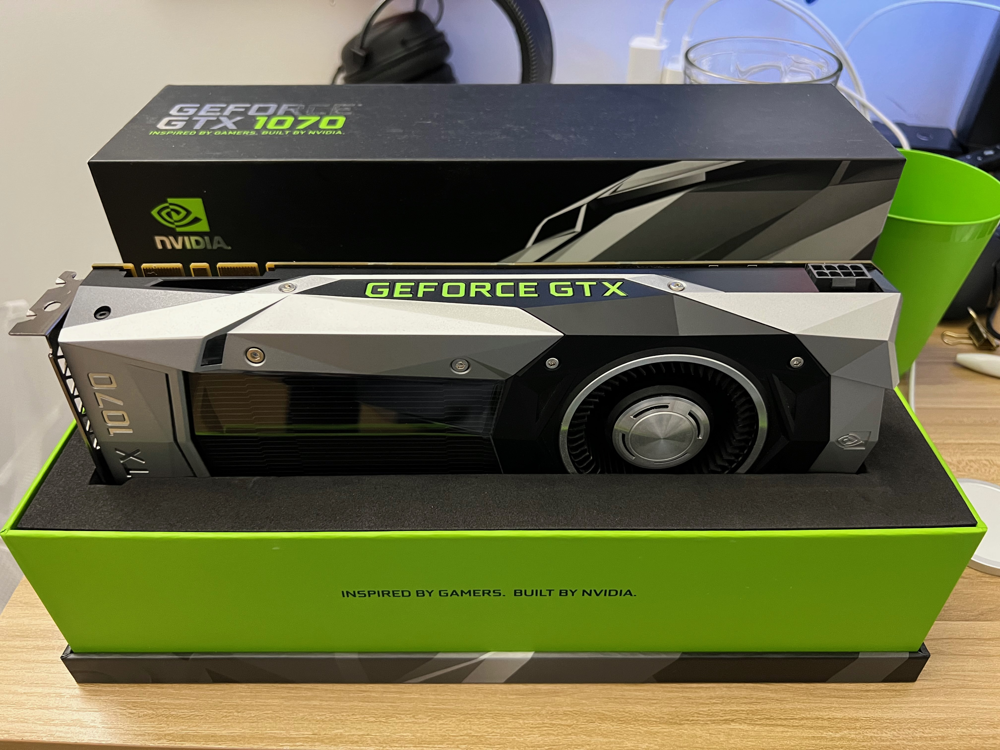

My intended major in graduate school would be Electrical Engineering or Computer Engineering. This is quite different from what I’ve been doing as an undergrad, which is mostly programming and working with software. I believe I need to make this change, because I realized in my college life that I’m really interested in hardware and design, not about writing software (although it seems that I’m also very good at doing that). 

# What I do in my spare time

I’m gonna introduce my experience with computers and other gadgets I have, and I will include some photos I took as well. 

## Mechanical Keyboard

I’ve been interested in consumer electronics for a really long time and it’s my biggest hobby right now. I bought a mechanical keyboard when I entered college, and that pretty much signified the start of this hobby. Immediately after getting the keyboard, I started thinking about ways of making it better. This quickly escalated to me entering the custom mechanical keyboard hobby. I studied in China in my Sophomore year because of covid, and I got the chance of purchasing a lot of keyboard stuff because a lot of them are made in China. I went on to build my own custom keyboard, starting from components made from custom cut acrylic. Mechanical switches is the most important part of a keyboard, and I also tried lubing my switches (yes we put oil inside mechanical switches to make it smoother, by hand). This hobby went through most of my Sophomore year, and I gradually devoted less time in it starting in Junior year, because newer mechanical switches don’t offer that much improvement now. I moved on to custom PCs then. 

Opening each switch, and manually apply lube. It was a tedious process.

My keyboard of choice for a long time. I later swapped in a brass plate and some dampening form. The keycaps are not present in this picture. 

Keyboard with brass plate and dampening foam, and I also changed the switches as well.

## Custom PCs

As a person interested in computers, it’s obvious that I want to build my own PC. I had the chance to do that at the start of my Junior year. As soon as I arrived at New York, I went to Microcenter and bought the parts of my first PC. Graphics card prices were all-time high at that time, and I borrowed an old GTX 1080 from my roommate. 

Purchasing PC parts at Microcenter

PC build done

My PC went through minor upgrades until I purchased an RTX 3080 Ti in March this year. I really like the NVIDIA founders design, and I spent extra effort trying to get one for cheap on eBay. I liked the graphics card so much that probably 20 photos in my phone is about it. It was the magic moment for me, as it opened up new video games I can play, and further convinced me that what I’m really interested in is computer hardware instead of software.

The exciting unboxing moment

I have a 3080 Ti now !!!

The performance of this card was great, but the temperature was not. I learned that the GDDR6X memory this card used is incredibly hot from the monitoring tool I have on my PC. I went on to modify this card by swapping the thermal pads for the memory modules (and probably voiding my warranty immediately. I void warranties.) From my experience with mechanical keyboards, I was adept at taking things apart, and I made sure not to break this $1600 graphics card.

Bare PCB of my 3080 Ti. I opened it up to do preventive maintenance. It’s mesmerizing for me to look at it. This picture is on my computer graphics homepage.

I liked NVIDIA’s products so much (not so much about their marketing), that I bought another graphics card just because I want to be a collector. It was a founders edition GTX 1070. I chose this because I liked its exterior design.

Unboxing the 1070. It looks glorious.

I put the 1070 on my table as a showpiece. It’s to the right of the monitor stand behind the iPad.

Built a PC for my friend. I also used this opportunity to sell some of my old parts.

Apart from building the PC, I also tried overclocking to squeeze every bit of performance from it. However, overclocking required too much time doing testing and tweaking and I didn’t get too deep into this. However, I do understand a lot on how overclocking works (voltage-frequency curve), as I watch tech YouTubers on a regular basis. 
My 3080 Ti also gave me the idea that, we need to care about a chip’s power consumption in addition to its performance. The card consumes 400 watts of power under full load, and it’s enough to force me to turn on the air conditioner while gaming. 

I started caring about power efficiency of my parts, and bought the M2 MacBook Air on the day preorder started, as I’m curious on the hype about Apple silicon. What surprised me was not its performance, but its efficiency. While my PC idles at 100 watts and consumes about 600 watts at full load, the MacBook Air ides at less than 5 watts and consumes at most 30 watts. I was amazed by the battery life of such a thin and light device. Even considering the massive performance difference of M2 with my custom PC, I still feel that Apple silicon was an incredible milestone in the development of chips. The future of high performance PCs might even gradually transition to ARM architecture instead of x86. 

The new NVIDIA graphics card now pulls upwards as much as 600 watts; the 13th generation Intel CPU needs 300 watts, and the 7000 series Ryzen CPU uses about 170 watts. All these power draws are significantly higher than those just a few years ago, almost doubled in some situations. This is partly because the intense competition between the chip companies, but I feel concerned about this trend. This is part of the reason that I’m interested in power efficiency of chips, and I would like to research that in the future, in addition to computer architecture and chip design.

## Hi-Fi Audio

This is a minor branch of my interest in electronics. I got into this at the beginning of this semester, partly because I already have some of the best PC parts I can buy, and I need to satisfy my unboxing needs. Hi-Fi audio is an expensive hobby, somewhat similar to photography. It is also much more subjective than DIY PCs, as the “best” sound does not exist, and every person has his or her own preference. Although I bought a pair of high end in-ear monitors and desktop DAC, I’m still active learning in the audiophile space.

AKG N5005 IEMs

# What Motivates Me

## Focus on the process, not the result. 
I'm a process-motivated person. That means I care about how and why I do my work, but not whether my work will lead to some good result (performing good on exams for example). I believe this is the correct way for me, and if I really put in the work and care about every detail, the good result will come eventually. 

Another benefit of this approach is that I seldom get setbacks because I get bad result. If I already put in all the work I can do, and tried everything I can, but still got a bad result, then there's nothing to be sad about. That's because this is what I can do, and I'm happy to learn that I'm not good at something. It's good to learn about ourselves, even if the knowledge is that we are not good at doing something. I had a plan on studying Chemistry when I first entered college, and I left that behind as soon as in Sophomore year. However, I feel quite OK about that, because it's fine for me to not be good at something, and it made me know myself better. 

Failing at something is OK. What's not OK is not trying. The biggest shame of your life is not failing at something, it's knowing that you could have done better. 

## Focus on the effect of my work, not just whether I did the work or not

This point might seem contradictory to the previous one, but it's different. It means for everything I do, I demand that the work can provide something useful for me. In other words, I don't do meaningless or superficial work. Social events, group meetings, and collaborative work involving more than a few people don't interest me at all. I don't want to waste time on meaningless talk with colleagues or making plans that would never be realized. 

That also means I focus a lot on my workflow, and I take every opportunity to improve it. I care about every tool I use, and that's part of the reason I'm interested in mechanical keyboards and PCs. They are tools that I use everyday. I learned keyboard shortcuts on my own, and my classmates know me as a person very good at "controlling my computer" and doing "slick moves" with it. 

On the opposite side, I'm a person that almost never take notes in class. I can comfortably walk into a classroom without bringing a laptop or notebook. That's because I value thinking over memorization all the time. If I focus on taking notes in class, then I won't have any brain left to really understand what the professor is taking about. This brings up the topic of "fake work". Some students may appear to be very diligent and hard-working, but they never get good grades. That's because they skip the part of thinking in the learning process, and they don't care whether their hardworking actually means anything. 

## Independent thinking

I dislike group work and conversations not because I don't like to cooperate, but it's because I prioritize independent thinking. If cooperation is really necessary, I make sure that I have my own thoughts on the problem before listening to another person's ideas. 

If I'm stuck at a problem in my work, I usually try to figure it out on my own for at least an hour, before seeking help from others. Most of the time, I was able to solve the problem in this hour. Obviously I can save some time by just asking, but I believe the process of independent thinking and trying is more meaningful. 